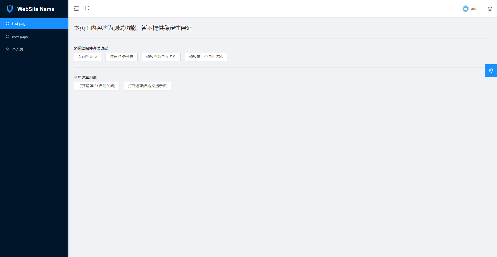

# Ant Design Vue2 Template

预览
----
基于 [Ant Design Vue Pro](https://github.com/vueComponent/ant-design-vue-pro) 的简化版本





环境和依赖
----

- node 版本 推荐18.x.x
- yarn
- webpack
- eslint
- @vue/cli
- [ant-design-vue@1.x](https://github.com/vueComponent/ant-design-vue) - WebSite  Name Of Vue 实现
- [vue-cropper](https://github.com/xyxiao001/vue-cropper) - 头像裁剪组件
- [@antv/g2](https://antv.alipay.com/zh-cn/index.html) - Alipay AntV 数据可视化图表
- [Viser-vue](https://viserjs.github.io/docs.html#/viser/guide/installation)  - antv/g2 封装实现


安装 yarn
```
npm install -g yarn
```
> 请注意，本项目使用 [Yarn](https://yarnpkg.com/) 包管理工具


项目下载和运行
----

- 拉取项目代码
```bash
git clone https://github.com/lorilu-studio/template-ant-design-vue2.git
cd ant-design-vue-pro
```


- 安装依赖
```
yarn install
```

- 开发模式运行
```
yarn run serve
```

- 编译项目
```
yarn run build
```

- Lints and fixes files
```
yarn run lint
```


## 浏览器兼容

Modern browsers and IE10.

| [](http://godban.github.io/browsers-support-badges/)</br>IE / Edge | [](http://godban.github.io/browsers-support-badges/)</br>Firefox | [](http://godban.github.io/browsers-support-badges/)</br>Chrome | [](http://godban.github.io/browsers-support-badges/)</br>Safari | [](http://godban.github.io/browsers-support-badges/)</br>Opera |
| --- | --- | --- | --- | --- |
| IE10, Edge | last 2 versions | last 2 versions | last 2 versions | last 2 versions |
 